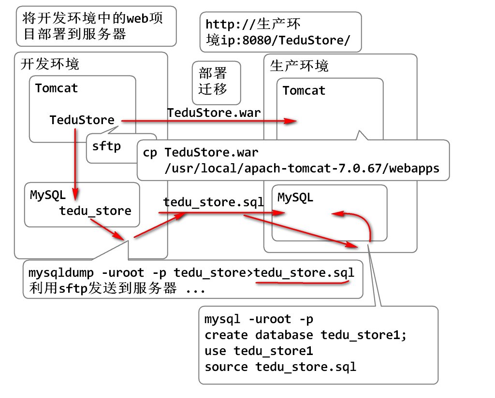

# Linux

## 什么是Linux

1. Linux 是一款类Unix的操作系统。
2. Linux 使用非常广泛
	- Android 到 云计算无所不在

## Linux 命令

1. 适合远程管理服务器
2. 资源占用低

Linux命令语法

	命令  -选项  参数1 参数2 参数3  

### 列文件夹的内容

	ls -al /
	
	-a 显示全部内容
	-l 显示长格式
	
	/ 参数，目标文件夹

### 如何查询命令的帮助

	man 命令， 使用q按键退出手册
	命令 --help

### Linux 的文件系统

	/   根目录
	|- etc  <-
	|- usr	
	|- home
	|   |- soft01   用户的主目录
	|- root   root用户的主目录
	|- var
	...

当前工作目录

	pwd  显示当前的工作目录
	cd 目标文件夹  改变当前工作目录

### 文件操作管理命令

1. 创建文件夹

	cd    返回用户的主目录
	mkdir 文件夹名  在当前文件夹中创建文件夹
	mkdir 绝对路径名 在指定位置创建文件夹

	如:
	cd
	mkdir demo
	mkdir /home/soft01/abc

2.  创建文件 

	touch 文件名

3. 修改时间

	touch 已经存在文件名/文件夹
	ls -l

4. 复制文件/文件夹命令

	cp 源文件/文件夹 目标文件/文件夹
	
	源文件/文件夹必须存在! 不存在就会报错误.
	目标文件/文件夹不存在就是创建新的文件/文件夹
	如果目标文件/文件夹是存在, 文件则覆盖,文件夹
	就是复制到文件夹中.

	cp /etc/passwd  passwd.bak   改名复制
	cp /etc/passwd  test  不改名复制
	cp /etc/passwd  test/pwd  改名复制
	cp /etc/passwd  .   复制到当前目录
	
	复制文件夹必须使用 -r 进行递归复制
	cp -r test abc  abc不存在,将test复制为abc
	mkdir demo
	cp -r test demo 将文件夹复制到demo文件夹中

### 改名或者移动

	mv 源 目标
	
	源:必须存在
	目标:如果不存在,就是改名 目标如果存在就是移动

### 删除命令

	rm -rf 文件 文件夹 文件夹....
	
	rm -rf passwd.bak passws t

## 远程登录


### 安装ssh

```text
如果你用的是redhat，fedora，centos等系列linux发行版，那么敲入以下命令：
sudo yum install sshd 或
sudo yum install openssh-server（由osc网友 火耳提供）

如果你使用的是debian，ubuntu，linux mint等系列的linux发行版，那么敲入以下命令：
sudo apt-get install sshd 或
sudo apt-get install openssh-server（由osc网友 火耳提供）
然后按照提示，安装就好了。

开启ssh服务
service ssh start

卸载
如果你用的是redhat，fedora，centos等系列linux发行版，那么敲入以下命令：
yum remove sshd
如果你使用的是debian，ubuntu，linux mint等系列的linux发行版，那么敲入以下命令：
sudo apt-get –purge remove sshd
```

## sftp

- ftp 占用21端口, 文件传输协议, 用于在客户端和服务器之间传输文件, 采用明码传输文件数据, 不安全.
- sftp 是 SSH 协议提供的功能, 与SSH占用一样的22端口, 也可以在客户端和服务器之间传输文件, 采用加密传输, 安全可靠.

### sftp 命令


```text
lls 查看本地目录内容
lcd 切换本地文件夹
lpwd 查看本地文件夹位置
ls  查看远程目录内容
cd  切换远程目录
pwd 查看远程文件夹位置
put 上载文件到远程文件夹
get 下载文件到本地文件夹
```

## 打包命令

打包:

	tar -czvf 文件.tar.gz 文件 文件夹 ...
	
	-c 创建包
	-z 将包进行gzip压缩, 建议文件名 .tar.gz
	-v 查看打包过程
	-f 指定打包以后的文件名: .tar 结尾
	-p(小写)：保留备份数据的原本权限与属性，常用于备份(-c)重要的配置文件
	-P(大写)：保留绝对路径，亦即允许备份数据中含有根目录存在之意
	-C(大写)：打包的时候使用指定前缀打包，在解压的时候 -C 是解压到指定目录中

释放:

	tar -xzvf 文件.tar.gz
	
	-x 释放, x和c不能共存
	-z 在.gz为结尾时候使用

## vi 可视化编辑器

- 基于终端窗口的可视化编辑器
  - 不能鼠标
- vi 的作者是Java创始人之一
- 开源的vim克隆了vi


## 利用wget下载

语法:

```text
wget http://download.oracle.com/otn-pub/java/jdk/8u171-b11/512cd62ec5174c3487ac17c61aaa89e8/jdk-8u171-linux-x64.tar.gz
```

## 配置Java环境变量

```text
export JAVA_HOME=/usr/local/java/jdk1.8.0_144
export PATH=/usr/local/java/jdk1.8.0_144/bin:$PATH
export CLASSPATH=.
```

### PATH

操作系统可执行命令的搜索路径, 操作系统在执行命令时候, 会将用命令名依次搜索PATH变量中的系列路径, 如果搜索到相同名字的程序(命令)就执行这个命令, 否则没有搜索到则报错误: 命名没有找到!!

## profile

Linux 操作系统初始化脚本 profile 

初始化顺序:


查看profile 

	ls /etc|grep profile
	cat /etc/profile   //查看文本文件内容
	more /etc/profile  //分页查看文本文件内容

修改

	$su   //切换用户身份, 如果不加参数则切换到管理员 需要输入密码
	#cd /etc
	#cp profile profile.2018.4.28
	#vim profile

修改内容:

	export PATH=/bin:/usr/local/bin:/usr/local/sbin:/usr/bin:/usr/sbin:/bin:/sbin:/root/bin
	
	export JAVA_HOME=/usr/local/java/jdk1.8.0_144
	export PATH=/usr/local/java/jdk1.8.0_144/bin:$PATH
	export CLASSPATH=.

测试:

	cat profile
	source profile
	javac -version
	which javac
	which java
	which tar
	echo $PATH 

重新启动服务器

	reboot

## yum安装与卸载

- 显示已经安装的软件包

> yum list installed

- 查找可以安装的软件包（以 tomcat 为例）

>  yum list tomcat

- 安装软件包（以 tomcat 为例）

> yum install tomcat
>
> yum -y install tomcat // 自动选择yes，无需在安装过程中输入y

- 卸载软件包（以 tomcat 为例）

> yum remove tomcat // 通过查看安装软件，找到对应的软件进行删除

- 列出软件包的依赖（以 tomcat 为例）

> yum deplist tomcat

- info 显示软件包的描述信息和概要信息（以 tomcat 为例）

> yum info tomcat

- 升级软件包
  - 升级所有的软件包

  > yum update

  - 升级某一个软件包 ，以升级 tomcat 为例

  > yum update tomcat

  - 检查可更新的程序

  > yum check-update

- Yum 可视化图形界面 Yumex

  yum Extender (简称 yumex ) , 是 yum 的图形化操作界面。可以通过 yumex 方便的查看软件包，安装、卸载软件包。对于对命令行不熟的人简直就是神奇，管理软件包很方便。

    - yumex 安装

    > yum install yumex
  
  - 在图形界面可以打开 yumex 进行管理

## 安装Git

### yum安装

    yum -y install git

yum安装git被安装在/usr/libexec/git-core目录下

### 源码安装

1. 下载源码

    进入git在GitHub上发布版本页面https://github.com/git/git/releases，选择最新版的tar.gz包，然后通过sftp协议上传至服务器
    或者复制链接，进入服务器终端，centos使用wget 地址，进行下载

2. 解压压缩包

    tar -zxvf xxxxx.tar.gz

3. 安装编译所需要的依赖

    yum install curl-devel expat-devel gettext-devel openssl-devel zlib-devel gcc perl-ExtUtils-MakeMaker
    (有些具体我也不清楚)

4. 安装编译源码所需依赖的时候，yum自动帮你安装了git，需要先卸载这个旧版的git

    yum -y remove git

5. 编译git源码

    make prefix=/usr/local/developtools/git all

6. 安装git至`/usr/local/developtools/git`目录下

    make prefix=/usr/local/developtools/git install

7. 配置环境变量

    vim /etc/profile
    在最下面加上：
        export PATH=$PATH:/usr/local/developtools/git/bin

8. 刷新环境变量

    source /etc/profile
    这里最好备份一份，以防所有环境变量失效

9. 查看Git是否安装完成

    git --version

10. 创建一个git用户组和用户，用来运行git服务

    groupadd git    #创建git组
    useradd git -g git  #创建git用户
    passwd git      #参数是用户名
    su - git        #切换git用户

    [注] 最好切换到git用户 不然后面新建的git仓库都要改权限

## 搭建gitblit

相似的还有gogs，gitlab等

1. 官网下载tar包

    wget https://github.com/gitblit/gitblit/releases/download/v1.9.1/gitblit-1.9.1.tar.gz
    或者使用 sftp上传

2. 解压

    tar -zxvf gitblit-1.9.1.tar.gz

3. 修改配置文件 ./data/default.properties

    修改路径
        git.repositoriesFolder = /usr/local/developtools/git-repository
    修改端口
        server.httpPort = 10101
    可以修改ssh端口：克隆后面的端口
        git.sshPort = 29418
    其他的不需要修改

4. 服务器防火墙端口配置

    firewall-cmd --permanent --add-port=10101/tcp
    firewall-cmd --reload

5. 安全组规则配置，在服务器上（例如阿里云控制台），添加安全组规则 10101

6. 访问：http://ip:10101 默认用户名admin 密码admin


## 安装gitlab

1. 安装ssh

    sudo yum install -y curl policycoreutils-pythonopenssh-server

2. 设置SSH服务开机自启

    systemctl enable sshd

3. 启动ssh

    systemctl start sshd

4. 安装Postfix以发送通知邮件
   
    yum install postfix

5. 设置Postfix自启动

    systemctl enable postfix

6. 启动Postfix

    systemctl start postfix

    此时可能会报错：Job for postfix.service failed because the control process exited with error code. See "systemctl status postfix.service" and "journalctl -xe" for details.
    解决方法是修改 /etc/postfix/main.cf 的设置
        inet_protocols = ipv4
        inet_interfaces = all

7. 利用wget下载gitlab镜像

    wget https://mirrors.tuna.tsinghua.edu.cn/gitlab-ce/yum/el7/gitlab-ce-10.0.0-ce.0.el7.x86_64.rpm

8. 安装gitlab

    rpm -i --prefix=/usr/local/developtools/gitlab gitlab-ce-10.0.0-ce.0.el7.x86_64.rpm
    在这里会报错有个依赖必须安装
    yum install policycoreutils-python

9. 修改gitlab配置文件指定服务器ip和自定义端口：

    vim /etc/gitlab/gitlab.rb

    external_url "http://ip(或域名):port"
    nginx['listen_port'] = port
    unicorn['port'] = 8088
    postgresql['shared_buffers'] = "256MB"
    postgresql['max_connections'] = 200

10. 重置并启动GitLab

    gitlab-ctl reconfigure
    gitlab-ctl restart

初始账户: root 密码:5iveL!fe
最后没有成功，我怀疑是我的内存不足导致的，因为我的服务器只有1G内存，所以可能是这个原因导致我无法跑的起gitlab

## 安装JDK

1. 下载Linux版本的JDK

2. 解压到指定的目录

3. 设置环境变量

    修改 /etc/profile

    export JAVA_HOME=/usr/local/developtools/jdk1.8.0_161
    export JRE_HOME=/usr/local/developtools/jdk1.8.0_161/jre
    export CLASS_PATH=.:$JAVA_HOME/lib/dt.jar:$JAVA_HOME/lib/tools.jar:$JRE_HOME/lib
    export PATH=$PATH:$JAVA_HOME/bin:$JRE_HOME/bin

4. 刷新配置文件

    source /etc/profile

5. 测试

    java -version

## 安装Tomcat

### yum安装

1. 安装

   yum -y install tomcat

2. 启动
   systemctl start tomcat.service

3. 关闭 

   systemctl stop tomcat.service

4. 重新启动

   systemctl restart tomcat.service

5. 设置开机自动启动

   systemctl enable tomcat.service

6. 下载Tomcat将ROOT复制到 /usr/share/tomcat/webapps

   > 下载地址从 Tomcat 网站获得

   	wget http://tomcat.apache.org....apache-tomcat-7.0.67.zip
   	yum -y install unzip
   	unzip apache-tomcat-7.0.67.zip
   	cd apache-tomcat-7.0.67/webapps
   	cp -r ROOT /usr/share/tomcat/webapps

### 下载安装Tomcat

1. 下载Tomcat并解压移动动到/usr/local下

   > 下载地址从 Tomcat 网站获得

   ```sh
   wget http://doc.tedu.cn/tomcat/apache-tomcat-7.0.67.zip
   unzip apache-tomcat-7.0.67.zip
   mv apache-tomcat-7.0.67 /usr/local
   ```

2. 启动tomcat

   cd /usr/local/apache-tomcat-7.0.67/bin
   	chmod +x *.sh   //为所有.sh文件增加执行权限
   	./startup.sh    //启动tomcat

3. 检查tomcat
   ps -A|grep java

4. 关闭tomcat

   ./shutdown.sh

5. 配置环境变量(可选):

   export CATALINA_HOME=/usr/local/apache-tomcat-7.0.67
   export PATH=CATALINA_HOME/bin:$PATH

6. 开放防火墙端口

   firewall-cmd --permanent --add-port=8080/tcp
   firewall-cmd --reload

   ```text
   注意：
   执行firewall-cmd --permanent --zone=public --add-port=3306/tcp，提示FirewallD is not running 解决办法:
     1. 通过systemctl status firewalld查看firewalld状态，发现当前是dead状态，即防火墙未开启。
     2. 通过systemctl start firewalld开启防火墙
     3. 再次通过systemctl status firewalld查看firewalld状态，显示running即已开启了。
     4. 如果要关闭防火墙设置，可能通过systemctl stop firewalld这条指令来关闭该功能。
     5. 再次执行执行firewall-cmd --permanent --zone=public --add-port=3306/tcp，提示success，表示设置成功，这样就可以继续后面的设置了。
   ```

7. 客户端测试:

   http:// ip : 8080


## 安装maven

### 源码安装

1. 下载maven并解压移动动到/usr/local/developtools下

    wget https://mirrors.bfsu.edu.cn/apache/maven/maven-3/3.6.3/binaries/apache-maven-3.6.3-bin.tar.gz
    tar -zxvf apache-maven-3.6.3-bin.tar.gz

2. 配置环境变量

    vim /etc/profile
    添加 PATH=$PATH:/usr/local/developtools/apache-maven-3.6.3/bin
    source /etc/profile

3. 检查

    mvn -version

4. 配置setting.xml

    ```xml
<localRepository>/usr/local/developtools/.m2/repository</localRepository>
    
    <mirrors>
        <mirror>
        <id>aliyun</id>
        <name>aliyun Maven</name>
        <mirrorOf>*</mirrorOf>
            <url>http://maven.aliyun.com/nexus/content/groups/public</url>
        </mirror>
    </mirrors>
    ```


## nexus安装与配置

1. 下载安装包

2. 上传解压

   ```text
   解压后出现两个文件夹
   nexus-3.19.1-01 主要用到这个文件夹
   sonatype-work 保存所有配置文件的信息(不用动)
   将两个文件同时移到一个nexus文件夹下方便管理
   ```

3. 进入nexus的bin目录启动

   ```text
   ./nexus start
   如果报错
   WARNING: ************************************************************
   WARNING: Detected execution as "root" user.  This is NOT recommended!
   WARNING: ************************************************************
   Starting nexus
   
   原因：当前是root用户，需要配置一下：
   bin目录下：vim nexus
   命令模式下搜索 RUN
   把#RUN_AS_USER= 改成RUN_AS_USER=root
   ```

   


## Jenkins 的安装与配置

1. 下载tomcat8并解压到指定目录
   wget https://mirrors.tuna.tsinghua.edu.cn/apache/tomcat/tomcat-8/v8.5.58/bin/apache-tomcat-8.5.58.tar.gz
   mv apache-tomcat-8.5.58.tar.gz /usr/local/
   tar -zxf apache-tomcat-8.5.58.tar.gz
   mv apache-tomcat-8.5.58 tomcat8
2. 下载war包并把 jenkins.war 放在 Tomcat 解压目录/webapps 目录下
   wget http://updates.jenkins-ci.org/download/war/2.235.1/jenkins.war
   mv jenkins.war /usr/local/tomcat8/webapps
3. 启动tomcat
   ./startup.sh

配置

1. 浏览器打开`localhost:8080/jenkins`
2. 安装默认插件（选
3. 增加管理员（选
4. 全局工具配置中配置相应的工具
5. 系统管理凭据中添加凭据：用户名和密码
6. 系统配置中配置SSH remote hosts（需要插件SSH）
7. 系统配置中配置Publish over SSH（需要插件Publish over SSH）这里的ssh key还是不太理解
8. 插件安装在插件管理中进行搜索安装

创建任务（gitlab+git+maven

1. 新建任务 ->任务名 -> 构建一个自由风格的软件项目
2. 源码管理 -> Git -> 填写仓库的SSH URL或者 HTTP URL ，选择合适的凭据(也就是事先配置的用户名和密码)
   注意这里拉去代码是否成功，可以去安装Jenkins的服务器用git clone 一下能够成功拉取，如果不能拉取则Jenkins也无法拉取代码，此时也需要将Jenkins服务起的公钥配置到gitlab上
3. 构建 -> 调用顶层Maven目标 -> 选择版本，目标填写构建语句例如"clean package -Dmaven.test.skip=true"，如果需要在构建时执行语句可以继续添加执行步骤，高级中指定pom.xml文件
4. 构建后操作步骤 -> send build artifacts over SSH -> 配置构建后上传文件或者执行语句或者两者都做
5. 保存应用后进行构建打开查看控制台输出

详细参考资料
[jenkins创建任务git+maven+publish over ssh部署到远程](https://blog.csdn.net/qq_36951116/article/details/103314349)
[Jenkins安装与配置](https://www.cnblogs.com/xxsl/p/6401636.html)

启动脚本参考：

```shell
#!/bin/bash
#这里可替换为你自己的执行程序，其他代码无需更改
JAR_NAME=$1
Suffix=jar
APP_NAME=$JAR_NAME.$Suffix
BASE_PATH=/data/program
#CUR_SHELL_DIR=`pwd`
JAR_PATH=$BASE_PATH/$JAR_NAME/$APP_NAME
#LOG_PATH=./logs/start.log
LOG_PATH=$BASE_PATH/$JAR_NAME/$JAR_NAME.out
#LOG_PATH=$LOG_DIR/${JAR_NAME}.log
#SPRING_PROFILES_ACTIV="-Dspring.profiles.active=eureka2"
#SPRING_PROFILES_ACTIV=""
#JAVA_MEM_OPTS=" -server -Xms1024m -Xmx1024m -XX:PermSize=128m"
#JAVA_MEM_OPTS=""
#使用说明，用来提示输入参数
usage() {
 echo "Usage: sh 脚本名.sh [project_name] [start|stop|restart|status]"
 exit 1
}

#检查程序是否在运行
is_exist(){
 pid=`ps -ef|grep $APP_NAME|grep -v grep|awk '{print $2}' `
 #如果不存在返回1，存在返回0 
 if [ -z "${pid}" ]; then
 return 1
 else
 return 0
 fi
}

#启动方法
start(){
 is_exist
 if [ $? -eq "0" ]; then
 echo "${APP_NAME} is already running. pid=${pid} ."
 else
# nohup java $JAVA_MEM_OPTS -jar $JAR_PATH >> $LOG_PATH 2>&1 &
 nohup java -jar $JAR_PATH >> $LOG_PATH 2>&1 &
 echo "${APP_NAME} start success"
 fi
}

#停止方法
stop(){
 is_exist
 if [ $? -eq "0" ]; then
 kill -9 $pid
 else
 echo "${APP_NAME} is not running"
 fi
}

#输出运行状态
status(){
 is_exist
 if [ $? -eq "0" ]; then
 echo "${APP_NAME} is running. Pid is ${pid}"
 else
 echo "${APP_NAME} is NOT running."
 fi
}

#重启
restart(){
 stop
 start
}

#根据输入参数，选择执行对应方法，不输入则执行使用说明
case "$2" in
 "start")
 start
 ;;
 "stop")
 stop
 ;;
 "status")
 status
 ;;
 "restart")
 restart
 ;;
 *)
 usage
 ;;
esac
```

## 安装MySQL

MySQL 分支为两个软件:

1. Oralce MySQL
2. MariaDB 

简单理解 MariaDB 就是MySQL

### yum 安装

1. 安装 

   yum -y install mariadb-server mariadb

2. 启动

   systemctl start mariadb.service

3. 检查

   ps -A|grep mysql

4. 关闭与重启

   systemctl stop mariadb.service
   systemctl restart mariadb.service

5. 设置自启动

    systemctl enable mariadb.service

#### MySQL 编码设置

1. 检查

   show variables like 'char%';
   	

   	+--------------------------+----------------------------+
   	| Variable_name            | Value                      |
   	+--------------------------+----------------------------+
   	| character_set_client     | utf8                       |
   	| character_set_connection | utf8                       |
   	| character_set_database   | latin1                     |
   	| character_set_filesystem | binary                     |
   	| character_set_results    | utf8                       |
   	| character_set_server     | latin1                     |
   	| character_set_system     | utf8                       |
   	| character_sets_dir       | /usr/share/mysql/charsets/ |
   	+--------------------------+----------------------------+

2. 修改配置文件, 设置数据库的默认编码

   vim /etc/my.cnf

   文件中添加:

   [mysqld]
   character-set-server=utf8

   [mysql]
   default-character-set=utf8

3. 重启MySQL(mariadb)


		systemctl restart mariadb.service

4. 检查

   show variables like 'char%';

   	+--------------------------+----------------------------+
   	| Variable_name            | Value                      |
   	+--------------------------+----------------------------+
   	| character_set_client     | utf8                       |
   	| character_set_connection | utf8                       |
   	| character_set_database   | utf8                      |
   	| character_set_filesystem | binary                     |
   	| character_set_results    | utf8                       |
   	| character_set_server     | utf8                      |
   	| character_set_system     | utf8                       |
   	| character_sets_dir       | /usr/share/mysql/charsets/ |
   	+--------------------------+----------------------------+

5. 添加或者修改密码

     set password for root@localhost = password('123');

### 源码安装MySQL(可能失败)

1. 查看旧版本

    rpm -qa |grep -i mysql

2. 强力删除

    rpm -e --nodeps 需要删除MySQL的版本

3. 删除`/etc/my.cnf`配置文件

    rm /etc/my.cnf

4. 下载MySQL软件包

    wget https://downloads.mysql.com/archives/get/p/23/file/mysql-5.7.16.tar.gz

5. 安装编译代码需要的包

    yum -y install make gcc-c++ cmake bison-devel ncurses-devel

    各个包功能的简单介绍：
    make    mysql源代码是由C和C++语言编写，在linux下使用make对源码进行编译和构建，要求必须安装make 3.75或以上版本
    gcc     GCC是Linux下的C语言编译工具，要求必须安装GCC4.4.6或以上版本
    cmake   mysql使用cmake跨平台工具预编译源码，用于设置mysql的编译参数。如：安装目录、数据存放目录、字符编码、排序规则等。
    bison   Linux下C/C++语法分析器
    ncurses 字符终端处理库

6. 解压`mysql-5.7.16.tar.gz`

    tar -zxvf mysql-5.7.16.tar.gz

7. 预编译

    cmake . -DCMAKE_INSTALL_PREFIX=/usr/local/developtools/mysql -DMYSQL_DATADIR=/usr/local/developtools/mysql/data/ -DDEFAULT_CHARSET=utf8 -DDEFAULT_COLLATION=utf8_general_ci
    
    此过程出现了一个错误：CMake Error at cmake/boost.cmake:81 (MESSAGE):....
    网上查询答案发现：高版本mysql需要boots库的安装才可以正常运行
    解决办法是：

        1. 在 /usr/local/developtools 下创建一个名为boost的文件夹
            mkdir -p /usr/local/developtools/boost
        2. 进入这个新创建的文件夹然后下载boost
            wget http://www.sourceforge.net/projects/boost/files/boost/1.59.0/boost_1_59_0.tar.gz
        3. 解压
            tar -xvzf boost_1_59_0.tar.gz
        4. 继续cmake，需要多加一个参数(最后面)
            cmake . -DCMAKE_INSTALL_PREFIX=/usr/local/developtools/mysql -DMYSQL_DATADIR=/usr/local/developtools/mysql/data/ -DDEFAULT_CHARSET=utf8 -DDEFAULT_COLLATION=utf8_general_ci -DWITH_BOOST=/usr/local/developtools/boost

8. 编译和安装

    make && make install

9. 初始化MySQL配置表

    进入MySQL目录
        groupadd mysql
        useradd mysql
    对MySQL下的所有文件授权
        chown -R mysql:mysql /usr/local/developtools/mysql
    生成data包
        在mysql目录下创建data目录
        mkdir data
        执行
        /usr/local/developtools/mysql/bin/mysqld --initialize --user=mysql --basedir=/usr/local/developtools/mysql --datadir=/usr/local/developtools/mysql/data
        执行完后，最后一行信息：2020-05-31T03:49:27.419859Z 1 [Note] A temporary password is generated for root@localhost: ZQ_#ogt*V5%=

        这里它给了root一个初始密码，后面要登录的时候要用到这个密码。

    将mysql/目录下除了data/目录的所有文件，改回root用户所有，mysql用户只需作为mysql/data/目录下所有文件的所有者
        chown -R root .
        chown -R mysql data

    复制配置文件(mysql目录下)
        cp support-files/my-default.cnf /etc/my.cnf

    mysql5.7配置文件需要修改my.cnf关键配置，mysql5.7之前默认配置文件中是有配置项的，不用手动修改

        [mysqld]
        basedir = /usr/local/developtools/mysql/mysql
        datadir = /usr/local/developtools/mysql/data
        port = 3306
        socket = /usr/local/developtools/mysql/tmp/mysql.sock
        
        sql_mode=NO_ENGINE_SUBSTITUTION,STRICT_TRANS_TABLES
        
        tmp目录不存在，请创建之。否则会出错，创建后要赋予mysql权限，chown -R mysql:mysql tmp，如果mysql.sock指定到/tmp以外的目录，需要在my.cnf中添加[client]并且指定socket位置，否则登录mysql时会报错：ERROR 2002 (HY000): Can't connect to local MySQL server through socket '/tmp/mysql.sock' (2) 应该是，默认会找tmp目录下的sock文件

10. 将mysqld服务加入开机自启动项。
    
    将 /usr/local/developtools/mysql/support-files/mysql.server 拷贝为 /etc/init.d/mysql 并设置运行权限，这样就可以使用service mysql命令启动/停止服务
        #cp ./support-files/mysql.server /etc/init.d/mysql
        #chmod +x /etc/init.d/mysql
    否则就只能使用/usr/local/developtools/mysql/bin/mysqld_safe --user=mysql & 命令来启动服务
    还需要把mysql.server中basedir的相关路径，改为自定义的路径，默认路径是/usr/local/mysql
    
    把mysql注册为开机启动的服务
        #chkconfig --add mysql

    查看是否添加成功
        chkconfig --list mysql
        mysqld          0:关闭  1:关闭  2:启用  3:启用  4:启用  5:启用  6:关闭


11. 配置环境变量

    修改 /etc/profile 添加如下内容
        export PATH=$PATH:/usr/local/developtools/mysql/bin
    刷新环境变量
        source /etc/profile

12. 登录mysql服务

    mysql -uroot -p 生成的密码
    连上后，在做任何操作前，mysql要求要改掉root的密码后才能进行操作。
        ERROR 1820 (HY000): You must reset your password using ALTER USER statement before executing this statement.
    需要执行：set password for root@localhost = password('123'); 

最后一步一直报错：ERROR 2002 (HY000): Can't connect to local MySQL server through socket '/usr/local/developtools/mysql/tmp/mysql.sock' (2)
不想在折腾了，直接yum安装得了

### MySQL源码安装二

1. 下载MySQL tar包 64位[下载路径mysql-5.7.23-linux-glibc2.12-x86_64.tar.gz)](http://mirrors.sohu.com/mysql/MySQL-5.7/)

2. 通过sftp上传服务器

3. 建立用户，并建立mysql存放目录

   ```text
   1. groupadd mysql #建立一个mysql的组
   2. useradd -r -g mysql mysql #建立mysql用户，并且把用户放到mysql组
   3. passwd mysql #给mysql用户设置一个密码
   ```

4. 解压到mysql目录

   ```text
   tar -zxf mysql-5.7.23-linux-glibc2.12-x86_64.tar.gz
   ```

5. 将文件名改名为mysql

   ```text
   mv mysql-5.7.23-linux-glibc2.12-x86_64 mysql
   ```

6. 添加文件`/etc/my.conf`

   ```text
   [mysqld]
   basedir = /usr/local/mysql
   datadir = /usr/local/mysql/data 
   # 默认端口是3306
   port = 3306
   character-set-server=utf8
   default-storage-engine=INNODB
   
   [mysql] default-character-set=utf8 
   [mysql.server] default-character-set=utf8 
   [mysql_safe] default-character-set=utf8 
   [client] default-character-set=utf8
   ```

7. 复制`mysql/support-files/`目录下的mysql.server到`/etc/init.d/mysql`

   ```text
   cp mysql.server /etc/init.d/mysql
   ```

8. 修改`/etc/init.d/mysql`参数

   ```text
   basedir = /usr/local/mysql
   datadir = /usr/local/mysql/data
   ```

9. 给目录/usr/local/mysql 更改拥有者

   ```text
   chown -R mysql:mysql /usr/local/mysql/
   ```

10. 初始化（在mysq的bin目录下）

    ```text
    ./mysqld --initialize --user=mysql --basedir=/usr/local/mysql --datadir=/usr/local/mysql/data
    
    记下临时登录密码
    ```

11. 启动数据库

    ```text
    nohup ./mysqld_safe --user=mysql >/usr/local/mysql/log-mysql.out 2>&1 &
    ```

12. 登录数据库（使用临时密码

    ```text
    ./mysql -uroot -p 
    ```

13. 设置密码

    ```text
    set password=password('root');
    ```

14. 设置环境变量

    ```text
    vim /etc/profile
    
    添加如下内容：
    export PATH=$PATH:/usr/local/mysql/bin
    
    最后导入下
    resource /etc/profile
    ```

15. MySQL重启
    使用 mysqld 脚本重启：/etc/inint.d/mysqld restart

### MySQL的访问控制

#### 改表法

1. 进入MySQL数据库
2. use mysql
3. update user set host = '%' where user = 'root'; // root用户可以通过任意主机访问
4. select host, user from user;
5. 重启数据库

#### 授权发

1. 进入MySQL数据库
2. GRANT ALL PRIVILEGES ON *.* TO 'root'@'%' IDENTIFIED BY 'root123' WITH GRANT OPTION;
3. FLUSH  PRIVILEGES;

### 通过脚本进行数据库备份迁移

#### 在本地打包后传输到目标服务器进行备份

大致脚本如下：

```shell
#!/bin/bash

DATETIME=`date +%Y_%m_%d_%H%M%S`
BAKDIR=$(pwd)/$DATETIME
PREFIX=mysqldump_
HOST=localhost
#DB_USER=root
#DB_PWD=root123

echo "=====start backup to $PREFIX$DATETIME.tar.gz"

# 文件夹不存在就创建
if [ ! -d "${BAKDIR}" ]; then
    mkdir ${BAKDIR}
fi

#mysqldump -h ${HOST} -u${DB_USER} -p${DB_PWD} bs_log > ${BAKDIR}/bs_log.bak.sql

# 前提是在/etc/my.cnf 下增加mysqldump命令的用户名和密码
mysqldump -h ${HOST} -B bs_log > ${DATETIME}/bs_log.bak.sql

echo "=====start packge tar"

tar -zcvf $PREFIX$DATETIME.tar.gz $DATETIME

echo "=====end packge tar"
```

需要提前在`/etc/my.cnf`配置文件添加如下内容
不然MySQL5.6及以后就会报出警告："mysql: [Warning] Using a password on the command line interface can be insecure "

```bash
[mysqldump]
user=root
password=root123
```

添加后在备份脚本中就不需要涉及用户名密码相关信息

运行脚本后涉及到的备份文件都会打包成 tar.gz 传输到服务器解压后依次恢复即可

相关命令：

```sql
sftp username@host

tar -zxvf xxx.tar.gz

方式一（在命令提示符窗口
mysql –u root –p < xxx/backup.sql

方式二（在mysql命令行
mysql> source xxx/backup.sql;
```

#### 直接在目标服务器进行远程迁移

前提是:`目标服务器可以直接连接该数据库`

脚本如下：

```bash
#!/bin/bash

DATETIME=`date +%Y_%m_%d_%H%M%S`
BAKDIR=$(pwd)/$DATETIME
HOST=localhost
REMOTE=10.253.46.249
DB_USER=root
DB_PWD=root123

echo "=====start migrate the database to here"
# 文件夹不存在就创建
if [ ! -d "${BAKDIR}" ]; then
    mkdir ${BAKDIR}
fi
mysqldump -h ${REMOTE} -u${DB_USER} -p${DB_PWD} -B bs_log > ${DATETIME}/bs_log.bak.sql
mysql -h ${HOST} -u${DB_USER} -p${DB_PWD} < ${DATETIME}/bs_log.bak.sql
rm -rf $DATETIME
echo "=====end migrate"
```


## 部署Web项目到服务器

原理:




### 1. 迁移数据库

1. 源服务器上导出现有数据库到SQL

   mysqldump -uroot -p tedu_store > tedu_store.sql

   > `>` 符号是"输出重定向", 其目的是将第一个mysqldump命令的结果送到一个文件tedu_store.sql 中.

2. sftp 将tedu_store.sql 传输到目标数据库服务器

   > windows版本的putty软件带来了 psftp, 可向服务器传输数据 

3. 在目标服务器的MySQL控制台执行

   create database tedu_store; // 创不创建数据库取决于备份出来的数据文件中是否有创建数据库和判断数据库存不存在之类的语句
   use tedu_store;
   source tedu_store.sql;

### 2. 部署Java Web 应用到目标Tomcat服务器

1. 利用开发工具将项目导出war文件

   - 导出前将数据库的配置信息改写目标的数据库配置信息

2. 利用sftp将war文件传输到目标服务器

3. 在目标服务器上利用cp命令将war文件部署到Tomcat中

   cp TeduStore.war /usr/local/apach-tomcat-7.0.67/webapps

4. 重写启动Tomcat服务器

5. 如果有错误请查看日志文件

   cat /usr/local/apach-tomcat-7.0.67/logs/catalina.out

6. 测试

   http://生产环境ip:8080/TeduStore/user/showLogin.jsp

### 检查技巧

1. 检查MySQL, 确认数据库已经成功迁移, 要检查:数据库\表\数据.
2. 检查Tomcat, 确认db.properties是否正确配置了数据库参数
3. 检查Tomcat是否成功启动.
   - ps -A|grep java
4. 检查Tomcat日志:
   - /usr/local/apache-tomcat-7.0.67/logs
5. 在防火墙上开启 8080 端口

### 远程访问MySQL

连接原理为:


数据库服务器端

1. 创建一个用户专门用于远程访问 

   //创建用户并且授权的命令
   	GRANT ALL ON 数据库名.* TO 用户名@客户端的ip/域名 
   	IDENTIFIED BY "密码";

   	例如:
   	GRANT ALL ON database.* TO root@host IDENTIFIED BY "root123";
   
> 客户端的ip是 192.168.17.12, 用户名是tedu 密码是tedu123

2. 服务器防火墙开放 3306 端口(如果需要的话)

   firewall-cmd --permanent --add-port=3306/tcp 
   	firewall-cmd --reload

客户端

1. 利用mysql 客户端连接到服务器端检查是否能够连接

   mysql -h192.168.17.70 -utedu -ptedu123

   > MySQL 服务器的IP是192.168.17.70

2. 更新 Tomcat中的应用程序参数db.properties 连接到远程的数据库:

   url=jdbc:mysql://47.105.48.39:3306/tedu_store?useUnicode=true&characterEncoding=utf8
   	driver=com.mysql.jdbc.Driver
   	user=tedu
   	password=tedu123

3. 测试...

## 文件权限 

Linux 限定用户可以读写那些文件.

查看文件的权限:

	ls -l   以长格式显示文件列表, 包含权限信息
	ll      CentOS Linux提供的简写命令

文件权限:


利用chmod设置文件的权限:


### 文件的执行权限

Linux中的可执行文件(命令), 必须满足两个条件才行:

1. 这个文件本身是可以执行的文件
   - 一种是2进制的程序文件
   - shell脚本文件(.sh), 是一种文本文件, 每行都是可以执行命令
2. 这个文件必须有执行权限

满足如上两个条件才能执行.

### shell 脚本

shell脚本文件(.sh), 是一种文本文件, 每行都是可以执行命令

shell用于批量执行操作系统命令, 可以实现运维自动化

案例: 自动备份MySQL数据库, 并且传输到远程的服务器


## 输出重定向

标准输出: Java 中的 System.out 标准输出流, 默认输出到操作系统控制台, 向标准输出写的信息将出现在操作系统控制台上.

输出重定向: 将标准输出的方向从控制台转移定向到其他输出目标, 常见的输出目标是文件.

操作系统提供了一个符号 `>` 实现输出重定向

	ls /   标准输出到控制台
	ls / > list.txt   将ls命令的输出重新定向到list.txt文件

输出重定向的用途

1. 实现命令执行的日志信息记录
2. 简便创建文本文件

与echo命令配合可以实现简便创建文本文件

	echo abc>demo.txt
	echo def>>demo.txt

一个案例: 利用一个脚本自动化实现创建Java文件并且编译执行Java程序

利用vim创建	demo.sh文件: 

	echo "public class HelloWorld{">HelloWorld.java
	echo "  public static void main(String[] args){">>HelloWorld.java
	echo '    System.out.println("Hello World!");'>>HelloWorld.java
	echo "  }">>HelloWorld.java
	echo "}">>HelloWorld.java
	cat HelloWorld.java
	javac HelloWorld.java
	java HelloWorld

执行:

	chmod +x demo.sh
	./demo.sh

# Nginx

Nginx 是一款高性能的Web服务器软件.

- 具有极高的并发性能
- 利用Nginx与Tomcat组合使用, 搭建反向代理集群 

> Nginx 反向代理集群可以解决网站的高并发问题!

## 常见Web Server

开源软件:

- Nginx
- Apache 
- Apache Tomcat (Java EE)
- Jetty (Java EE)

商业软件

- Microsoft IIS 
- IBM Webspare (Java EE)
- Oracle Weblogic (Java EE)

等

> Java EE WEB 服务器也称为 Java WEB 容器.

## 使用Nginx

### yum 安装

安装

	yum -y install nginx

启动

	systemctl start nginx.service

关闭

	systemctl stop nginx.service

重新启动

	systemctl restart nginx.service

设置开机启动

	systemctl enable nginx.service

检查

	ps -A|grep nginx

测试:

	http://ip地址

### 源码编译安装 

参考文档： [http://nginx.org/en/docs/configure.html](http://nginx.org/en/docs/configure.html)

安装步骤:

1. 下载源代码

   wget http://nginx.org/download/nginx-1.12.2.tar.gz

2. 创建nginx用户

   useradd nginx

3. 创建 nginx 的安装目标目录

   mkdir /usr/local/nginx

4. 安装编译时候需要的依赖包(可选)

   yum -y install pcre-devel openssl openssl-devel 

5. 释放并且编译

   tar -zxf nginx-1.12.2.tar.gz
   cd nginx-1.12.2
   ./configure --prefix=/usr/local/nginx --user=nginx --with-http_ssl_module
   make
   make install


具体实验步骤:

	cd	
	cp -r /usr/local/nginx/nginx-1.12.0 .
	useradd nginx
	cd nginx-1.12.0
	./configure --prefix=/usr/local/nginx --user=ngin --with-http_ssl_module
	make
	make install

运行Nginx

	nginx -c /usr/local/nginx/conf/nginx.conf

检查进程

	ps -A|grep nginx


开启防火墙的80端口（可选操作）

	firewall-cmd --permanent --add-port=80/tcp
	firewall-cmd --reload

测试, 用浏览器访问

	http://ip

配置系统服务

    vim /etc/init.d/nginx
    源地址：https://www.nginx.com/resources/wiki/start/topics/examples/redhatnginxinit/
    找到nginx="..." NGINX_CONF_FILE="..." 这两句改成你自己的目录位置
    
        #!/bin/sh
        # nginx - this script starts and stops the nginx daemon
        #
        # chkconfig:   - 85 15
        # description:  NGINX is an HTTP(S) server, HTTP(S) reverse \
        #               proxy and IMAP/POP3 proxy server
        # processname: nginx
        # config:      /usr/local/tools/nginx/nginx-1.14.2/conf/nginx.conf
        # config:      /etc/sysconfig/nginx
        # pidfile:     /usr/local/tools/nginx/nginx-1.14.2/logs/nginx.pid
    
        # Source function library.
        . /etc/rc.d/init.d/functions
    
        # Source networking configuration.
        . /etc/sysconfig/network
    
        # Check that networking is up.
        [ "$NETWORKING" = "no" ] && exit 0
    
        # nginx 文件的目录 需要修改为自己的位置
        nginx="/usr/local/developtools/nginx/sbin/nginx"
        prog=$(basename $nginx)
        
        # nginx 配置文件的位置 需要修改为自己的位置
        NGINX_CONF_FILE="/usr/local/developtools/nginx/conf/nginx.conf"
    
        [ -f /etc/sysconfig/nginx ] && . /etc/sysconfig/nginx
    
        lockfile=/usr/local/tools/nginx/nginx-1.14.2/logs/lock/subsys/nginx
    
        make_dirs() {
        # make required directories
        user=`$nginx -V 2>&1 | grep "configure arguments:.*--user=" | sed 's/[^*]*--user=\([^ ]*\).*/\1/g' -`
        if [ -n "$user" ]; then
            if [ -z "`grep $user /etc/passwd`" ]; then
                useradd -M -s /bin/nologin $user
            fi
            options=`$nginx -V 2>&1 | grep 'configure arguments:'`
            for opt in $options; do
                if [ `echo $opt | grep '.*-temp-path'` ]; then
                    value=`echo $opt | cut -d "=" -f 2`
                    if [ ! -d "$value" ]; then
                        # echo "creating" $value
                        mkdir -p $value && chown -R $user $value
                    fi
                fi
            done
            fi
        }
    
        start() {
            [ -x $nginx ] || exit 5
            [ -f $NGINX_CONF_FILE ] || exit 6
            make_dirs
            echo -n $"Starting $prog: "
            daemon $nginx -c $NGINX_CONF_FILE
            retval=$?
            echo
            [ $retval -eq 0 ] && touch $lockfile
            return $retval
        }
    
        stop() {
            echo -n $"Stopping $prog: "
            killproc $prog -QUIT
            retval=$?
            echo
            [ $retval -eq 0 ] && rm -f $lockfile
            return $retval
        }
    
        restart() {
            configtest || return $?
            stop
            sleep 1
            start
        }
    
        reload() {
            configtest || return $?
            echo -n $"Reloading $prog: "
            killproc $nginx -HUP
            RETVAL=$?
            echo
        }
    
        force_reload() {
            restart
        }
    
        configtest() {
        $nginx -t -c $NGINX_CONF_FILE
        }
    
        rh_status() {
            status $prog
        }
    
        rh_status_q() {
            rh_status >/dev/null 2>&1
        }
    
        case "$1" in
            start)
                rh_status_q && exit 0
                $1
                ;;
            stop)
                rh_status_q || exit 0
                $1
                ;;
            restart|configtest)
                $1
                ;;
            reload)
                rh_status_q || exit 7
                $1
                ;;
            force-reload)
                force_reload
                ;;
            status)
                rh_status
                ;;
            condrestart|try-restart)
                rh_status_q || exit 0
                    ;;
            *)
                echo $"Usage: $0 {start|stop|status|restart|condrestart|try-restart|reload|force-reload|configtest}"
                exit 2
        esac
    
    配置启动脚本权限：chmod a+x /etc/init.d/nginx
    启动nginx: /etc/init.d/nginx start
    停止nginx: /etc/init.d/nginx stop
    
    加入系统服务：chkconfig --add /etc/init.d/nginx
    使用systemctl启动nginx: systemctl start nginx
    使用systemctl停止nginx: systemctl stop nginx

开机自启

    systemctl enable nginx
    或者
    配置开机启动:vi /etc/rc.local在最后加一句/etc/init.d/nginx start

## Nginx 的配置文件结构

Nginx的功能是通过配置文件实现的, 使用Nginx就是会使用Nginx的配置文件.

nginx配置文件位置:

1. 编译安装版本
   - /usr/local/nginx/conf/nginx.conf
2. yum安装版本
   - /etc/nginx/nginx.conf

Nginx配置文件结构

	通用(全局)配置参数
	
	http{
		http 协议通用参数
	
		server{
			虚拟机配置参数
		}
	
		server{
			虚拟机配置参数
		}
	
	}

### 全局通用参数

1. worker_processes 

   > 建议按照处理器数量进行设置, 4处理器设置为4

   	worker_processes  1;

2. 每个进程的线程数量, 就是进程中线程池的大小.

   events {
   	    worker_connections  1024;
   	}

3. pid 文件用于存储 Nginx 主进程号

4. 日志文件, 如果打开可以记录日志,但同时服务器的性能也会下降

### http通用参数

1. ContentType 类型映射, 也就是多媒体文件类型映射.

   include       mime.types;
       default_type  application/octet-stream;

   > 使用include指令简化主配置文件.

2. keepalive 指定HTTP/1.1 协议时候的服务器端的长连接等待超时时间

   keepalive_timeout  65;

3. 对服务器的响应进行gzip压缩传输, 可以节省网络流量. 但是问题有两个, 一个是老旧浏览器(IE6)不支持, 第二个会占用服务器的处理器.

   gzip  on;

更新 Nginx配置文件实验

	cd /usr/local/nginx/conf
	cp nginx.conf nginx.conf.2018.5.3
	vim nginx.conf   //开放 http 访问日志, 开放gzip压缩
	//测试配置文件
	nginx -t -c /usr/local/nginx/conf/nginx.conf
	//热加载配置文件: 不停止nginx服务的情况下加载配置文件
	nginx -s reload

用浏览器进行测试	
查看 nginx/logs/access.log 日志文件

## 虚拟主机

在一个Web服务器上通过服务器软件模拟多台Web 服务器, 其中每个虚拟的Web服务器称为一个虚拟主机. 虚拟主机的好处是可以充分复用同一个web服务器. 对于用户来说, 用户感觉是多个网站.

Nginx 配置文件中 每个 server{} 块对应一个虚拟主机

虚拟主机有3种:

1. 基于域名的虚拟主机(最常用的虚拟主机)
   - 需要为服务器指定多个域名
   - 域名资源解析方便, 便于用户记忆, 用户体验好.
2. 基于IP虚拟主机
   - 需要为服务器指定多个IP地址
   - 需要租用IP
   - 很少使用这种方式
3. 基于端口的虚拟主机
   - 绑定到服务器的多个端口
   - 默认80端口只有一个
   - 使用其他端口号提供服务, 因为用户需要记忆端口, 用户的体验差

### 基于域名的虚拟主机工作原理


本地解析域名实验

	cd /etc
	cp hosts hosts.2018.5.3
	ping t1.canglaoshi.org  //不通
	vim hosts    添加  10.7.11.19  t1.canglaoshi.org
				 添加  10.7.11.19  t2.canglaoshi.org
	ping t1.canglaoshi.org  //通了 结束命令 Ctrl + C
	ping t2.canglaoshi.org  //通了

windows 实验

	用记事本编辑: C:\Windows\System32\drivers\etc\hosts
	notepad hosts
	添加  10.7.11.19  t1.canglaoshi.org
	添加  10.7.11.19  t2.canglaoshi.org
	ping t1.canglaoshi.org 通了 
	ping t2.canglaoshi.org 通了 

搭建Nginx基于域名的虚拟主机

编辑Nginx配置文件 nginx.conf

    # 请求 t1.canglaoshi.org 访问 t1文件夹 index.html文件
    server{
        listen  80;
        server_name  t1.canglaoshi.org;
        location / {
            root  t1;
            index index.html;
        }
    }
    # 请求 t2.canglaoshi.org 访问 t2文件夹 index.html文件
    server{
        listen  80;
        server_name  t2.canglaoshi.org;
        location / {
            root t2;
            index index.html;
        }
    }

在Nginx文件夹/usr/local/nginx中添加新文件夹t1,t2和文件index.html

	<html>
		<body>	
			<h1>Hello t1.canglaosho.org</h1>
		</body>
	</html> 

测试:

	http://t1.canglaoshi.org
	http://t2.canglaoshi.org

## HTTPS 加密通讯

HTTPS = HTTP Over SSL = 基于SSL加密的HTTP通讯

> HTTPS加密通讯不会被第三方监听.HTTPS是安全通讯.

证书工作原理:

1. 浏览器中内嵌了证书颁发机构的根证书, 用于鉴定证书的真伪
2. 建立网站时候需要向证书颁发机构申请证书, 用于证明网站域名的真实性.
   - 阿里云等云计算服务器可以代为签发证书
3. 将证书配置到Nginx等Web服务器
4. 在进行 HTTPS 通讯时候, 浏览器会自动从服务器下载证书并且自动鉴定证书真伪, 并且自动建立加密通讯通道. 


从阿里云申请证书:


下载证书:


实验步骤


> 具体的操作命令请根据实际情况灵活使用.

1. 下载证书文件到 /usr/local/nginx/conf/cert
2. 更新 nginx.conf 的配置, 并且测试配置文件
3. 重新启动Nginx
4. 在客户端配置域名解析
5. 利用客户端访问 https://tts.canglaoshi.org

参考的nginx.conf

	include tts.conf;

tts.conf

	server{
	    listen 80;
	    server_name tts.canglaoshi.org;
	    return 301 https://tts.canglaoshi.org;
	}
	
	server{
		#listen 443;
	    listen 443 ssl; 
	    server_name tts.canglaoshi.org;
	    
	    # ssl on;
	    
	    ssl_certificate   cert/214438499540580.pem;
	    ssl_certificate_key  cert/214438499540580.key;
	    ssl_session_timeout 5m;
	    ssl_ciphers ECDHE-RSA-AES128-GCM-SHA256:ECDHE:ECDH:AES:HIGH:!NULL:!aNULL:!MD5:!ADH:!RC4;
	    ssl_protocols TLSv1 TLSv1.1 TLSv1.2;
	    ssl_prefer_server_ciphers on;
	    location / {
	        root tts;
	        index index.html;
	    }
	}

> 注意: 域名与证书是成对使用的, 一个证书用于证明对应的域名.

## 反向代理集群

什么是反向代理:


反向代理集群的优势是提高网站整体的并发处理能力.

### 配置使用反向代理

配置原理:


配置步骤

1. 进行合理的规划: 规定每个服务器所扮演的角色.
2. 配置每个Tomcat应用服务器, 并且启动测试.
3. 配置Nginx服务器, 测试配置文件
4. 重新启动Nginx
5. 客户端配置域名解析
6. 客户端浏览器访问域名, 可以看到多台Tomcat为一个域名服务

参考的nginx.conf

	include tts.conf;

参考的 demo.conf

	upstream toms{
	    server 10.7.11.218:8080;
	    server 10.7.11.244:8080;
	    server 10.7.11.43:8080;
	}
	
	server{
	    listen 80;
	    server_name demo.canglaoshi.org;
	
	    access_log logs/demo.access.log;
	    error_log logs/demo.error.log;
	  
	    index index.jsp index.html;
	 
	    location / {
	        proxy_pass http://toms;
	        proxy_redirect     off;
	        proxy_set_header   Host             $host;
	        proxy_set_header   X-Real-IP        $remote_addr;
	        proxy_set_header   X-Forwarded-For  $proxy_add_x_forwarded_for;
	        proxy_next_upstream error timeout invalid_header http_500 http_502 http_503 http_504;
	        proxy_max_temp_file_size 0;
	        proxy_connect_timeout      90;
	        proxy_send_timeout         90;
	        proxy_read_timeout         90;
	        proxy_buffer_size          4k;
	        proxy_buffers              4 32k;
	        proxy_busy_buffers_size    64k;
	        proxy_temp_file_write_size 64k;
	   }
	
	}

### 阿里云配置Nginx转发到Tomcat

这里就可以将80和443端口的请求转发到Tomcat的8080端口了.

1. 配置Nginx 

   - yum安装的nginx配置文件在 /etc/nginx/nginx.conf

   - yum安装的nginx会自动包含 /etc/nginx/conf.d/*.conf, 所以将配置文件放到这个文件夹中就可以自动包含了.

   - 添加配置文件 1711.conf:

     upstream tomcat{
          server 127.0.0.1:8080;
     }
     	server {
     	    listen 80;
     	    server_name 1711.canglaoshi.org;
     	    

     	    index index.html index.jsp;
     	
     	    location / {
     	        proxy_pass http://tomcat;
     	        proxy_redirect     off;
     	        proxy_set_header   Host             $host;
     	        proxy_set_header   X-Real-IP        $remote_addr;
     	        proxy_set_header   X-Forwarded-For  $proxy_add_x_forwarded_for;
     	        proxy_next_upstream error timeout invalid_header http_500 http_502 http_503 http_504;
     	        proxy_max_temp_file_size 0;
     	        proxy_connect_timeout      90;
     	        proxy_send_timeout         90;
     	        proxy_read_timeout         90;
     	        proxy_buffer_size          4k;
     	        proxy_buffers              4 32k;
     	        proxy_busy_buffers_size    64k;
     	        proxy_temp_file_write_size 64k;
     	        
     	    }
     	}
     	
     	server{
     	    listen 80;
     	    server_name tom.canglaoshi.org;
     	    return 301 https://tom.canglaoshi.org;
     	}
     	
     	server{
     		# listen 443;
     	    listen 443 ssl;
     	    server_name tom.canglaoshi.org;
     	
     	    # ssl on;
     	    index index.html index.jsp;
     	    ssl_certificate   cert/214462831460580.pem;
     	    ssl_certificate_key  cert/214462831460580.key;
     	    ssl_session_timeout 5m;
     	    ssl_ciphers ECDHE-RSA-AES128-GCM-SHA256:ECDHE:ECDH:AES:HIGH:!NULL:!aNULL:!MD5:!ADH:!RC4;
     	    ssl_protocols TLSv1 TLSv1.1 TLSv1.2;
     	    ssl_prefer_server_ciphers on;
     	    
     	    location / {
     	        proxy_pass http://tomcat;
     	        proxy_redirect     off;
     	        proxy_set_header   Host             $host;
     	        proxy_set_header   X-Real-IP        $remote_addr;
     	        proxy_set_header   X-Forwarded-For  $proxy_add_x_forwarded_for;
     	        proxy_next_upstream error timeout invalid_header http_500 http_502 http_503 http_504;
     	        proxy_max_temp_file_size 0;
     	        proxy_connect_timeout      90;
     	        proxy_send_timeout         90;
     	        proxy_read_timeout         90;
     	        proxy_buffer_size          4k;
     	        proxy_buffers              4 32k;
     	        proxy_busy_buffers_size    64k;
     	        proxy_temp_file_write_size 64k;
     	    }
     	}


  > 配置了2个域名 其中 tom.canglaoshi.org 绑定了ssl证书

2. 测试 重新启动nginx
3. 在阿里云的dns解析中解析 两个域名tom.canglaoshi.org, 1711.canglaoshi.org 到服务器ip
4. 测试: 用浏览器访问这两个域名.

### Nginx 集群转发策略

Nginx 支持4中转发策略

1. 轮询（默认） 

   - 每个请求按时间顺序逐一分配到不同的后端服务器，如果后端服务器down掉，能自动剔除。 
   - weight 
     - 指定轮询几率，weight和访问比率成正比，用于后端服务器性能不均的情况。 

   

2. ip_hash 

   - 每个请求按访问ip的hash结果分配，这样每个访客固定访问一个后端服务器，可以解决session的问题。  

   

3. fair（第三方） 

   - 按后端服务器的响应时间来分配请求，响应时间短的优先分配。  

4. url_hash（第三方）

服务器临时离线: 利用down 可以实现服务器临时离线, 一般用于对服务器进行维护.

案例:

	upstream toms{
	    ip_hash;
	    server 10.7.11.218:8080 weight=10;
	    server 10.7.11.244:8080 weight=80;
	    server 10.7.11.43:8080  weight=20 down;
	}

# Redis

Redis 是一个基于内存的高性能的Key-Value非结构化数据库.

简单理解: Redis就是一个超大型的散列表, 算法类似于 HashMap!

1. 在内存计算, 采用了Hash表算法
2. 高性能
3. 自动提供持久化存储, 防止断电, 可以解决缓存预热问题
4. 支持5种数据类型(是5种Value类型, key类型只有一个String) 
5. 在软件架构中作为"缓存使用"

## Redis 安装

### Yum 安装 Redis

1. 安装

   yum -y install redis

2. 启动

   systemctl start redis.service

3. 重启等...

### 编译安装

下载Redis

	wget http://download.redis.io/releases/redis-3.0.0.tar.gz

安装gcc(可选)

	yum -y install gcc

编译 

	tar -zxf redis-3.0.0.tar.gz
	cd redis-3.0.0
	mkdir /usr/local/redis-3.0.0
	make PREFIX=/usr/local/redis-3.0.0 install

复制配置文件

	cp redis.conf /usr/local/redis-3.0.0

修改配置文件 redis.conf 设置后台启动

	修改配置文件，将其中的"daemonize no"行改为"daemonize yes"，让其在后台运行。

启动服务器

	/usr/local/redis-3.0.0/bin/redis-server /usr/local/redis-3.0.0/redis.conf &

> & 符号的作用是将程序放到后台执行

关闭服务

	/usr/local/redis-3.0.0/bin/redis-cli shutdown

端口查看情况：netstat -anp |grep 6379

redis设置密码

```text
> config set requirepass xxx
# 查看
> config get requirepass
(error) NOAUTH Authentication required.

密码验证：
> auth xxx
> config get requirepass

注：
	这样设置的密码重启后会失效

永久密码设置：
在redis.conf配置文件中有一行是这样的
#requirepass foobared  
去掉注释，并且把foobared改为自己的密码
requirepass root123
```


### 使用Redis

实验

1. 启动redis服务器
   cd
   	redis-server /usr/local/redis-3.0.0/redis.conf & 

2. 用客户端连接

   /usr/local/redis-3.0.0/src/redis-cli

3. 测试:

   SET message "Hello World"
   	GET message

4. 帮助命令

   HELP @string
   	HELP @[tab]

## Redis 的使用

命令参考手册 [http://redisdoc.com/](http://redisdoc.com/)

Redis 支持5种数据类型, 是指Value的类型

1. String 类型
2. Hash类型
3. List类型
4. Set类型
5. Sorted Set

Hash 类型


List 类型


### Redis 命令

1. 与key有关的命令
   - keys  del  exist
2. 与String有关的命令
   - set  get   strlen
   - String可以存储数字
     - incr decr incrby decrby incrbyfloat
3. 与Hash类型有关的命令
4. 与List类型有关的命令
5. 与Set类型有关的命令
6. 与ZSet类型有关的命令

## Jedis

Jdeis 是 Redis 官方推荐的Java Redis API

其主页地址为: [https://github.com/xetorthio/jedis](https://github.com/xetorthio/jedis) 

使用步骤:

1. 导入Jedis API

   <dependency>
   		<groupId>junit</groupId>
   		<artifactId>junit</artifactId>
   		<version>4.12</version>
   	</dependency>
   	<dependency>
   		<groupId>redis.clients</groupId>
   		<artifactId>jedis</artifactId>
   		<version>2.9.0</version>
   		<type>jar</type>
   		<scope>compile</scope>
   	</dependency>

2. 编写测试案例:

   @Test
   	public void testJedis(){
   		Jedis jedis = new Jedis("10.7.11.19");
   		jedis.set("fan", "传奇");
   		jedis.setex("login", 15, "Andy");
   		String str = jedis.get("fan");
   		System.out.println(str); 
   		jedis.close();
   	}
   	

> Jedis 对象提供了访问Redis数据库的全部方法. Redis有哪些操作命令, Jedis就提供了哪些操作方法.


## Spring Data Redis 

Spring 提供了Redis访问的支持, 其底层也使用了Jedis API.

Spring Data Redis 提供了面向对象的访问接口方法, 可以将对象直接序列化保存到Redis数据库中.

使用步骤:

1. 导入API

   <dependency>
   		<groupId>redis.clients</groupId>
   		<artifactId>jedis</artifactId>
   		<version>2.9.0</version>
   		<type>jar</type>
   		<scope>compile</scope>
   	</dependency>
   	<dependency>
   		<groupId>org.springframework.data</groupId>
   		<artifactId>spring-data-redis</artifactId>
   		<version>2.0.6.RELEASE</version>
   	</dependency>

2. 配置spring容器, 初始化RedisTempalte对象: spring-redis.xml

   <bean id="jedisConnFactory" 
   	    class="org.springframework.data.redis.connection.jedis.JedisConnectionFactory">
   	    <property name="usePool" value="true"/>
   	    <property name="hostName" 
   	    	value="10.7.11.19"></property>
   	</bean>
   	

   	<!-- redis template definition -->
   	<bean id="redisTemplate" 
   	    class="org.springframework.data.redis.core.RedisTemplate">
   	    <property name="connectionFactory"
   	    	ref="jedisConnFactory"/>
   	</bean>	

3. 使用RedisTemplate访问Redis

   ClassPathXmlApplicationContext ctx;
   	RedisTemplate<String, Object> tpl;
   	

   	@Before
   	public void init(){
   		ctx=new ClassPathXmlApplicationContext(
   				"spring-redis.xml");
   		tpl=ctx.getBean("redisTemplate",
   					RedisTemplate.class);
   	}
   	@After
   	public void destory(){
   		ctx.close();
   	}
   	
   	@Test
   	public void testRedisTemplate(){
   		tpl.opsForValue().set("man", "Java Man");
   		String str = (String)
   			tpl.opsForValue().get("man");
   		System.out.println(str);
   		System.out.println(tpl);
   	}
   	
   	@Test 
   	public void testSaveObject(){
   		User user = new User("范传奇", 12);
   		tpl.opsForValue().set("starMan",
   				user, 15, TimeUnit.SECONDS);
   		User guy=(User)tpl.opsForValue()
   				.get("starMan");
   		System.out.println(guy); 
   	}


## Redis 在互联网架构中的应用

Redis在互联网架构中经常充当数据库的缓冲作用, 将经常读取的数据缓冲到Redis中, 可以提高数据读取的效率, 实现"高性能".

## 为学子商城增加Redis缓存

学子商城是互联网项目, 性能直接关系到用户体验. 

为了解决学子商城的高性能问题, 为学子商城增加了Redis缓存, 提高数据的读取性能.

重构步骤:

1. 导入Spring Data Redis

   <dependency>
   		<groupId>org.springframework</groupId>
   		<artifactId>spring-webmvc</artifactId>
   		<version>4.3.8.RELEASE</version>
   	</dependency>
   	<dependency>
   		<groupId>org.springframework</groupId>
   		<artifactId>spring-jdbc</artifactId>
   		<version>4.3.8.RELEASE</version>
   	</dependency>
   	<dependency>
   		<groupId>org.springframework</groupId>
   		<artifactId>spring-aop</artifactId>
   		<version>4.3.8.RELEASE</version>
   	</dependency>
   	<dependency>
   		<groupId>redis.clients</groupId>
   		<artifactId>jedis</artifactId>
   		<version>2.9.0</version>
   		<type>jar</type>
   		<scope>compile</scope>
   	</dependency>
   	<dependency>
   		<groupId>org.springframework.data</groupId>
   		<artifactId>spring-data-redis</artifactId>
   		<version>1.8.2.RELEASE</version>
   	</dependency>

   > 注意:Spring容器版本提升到4.3.8.RELEASE, 这个版本与Spring-data-Redis: 1.8.2.RELEASE是兼容的.

2. 添加spring-redis.xml 配置文件

   <bean id="jedisConnFactory"
   		class="org.springframework.data.redis.connection.jedis.JedisConnectionFactory">
   		<property name="usePool" value="true" />
   		<property name="hostName" value="10.7.11.19"></property>
   	</bean>

   	<!-- redis template definition -->
   	<bean id="redisTemplate" class="org.springframework.data.redis.core.RedisTemplate">
   		<property name="connectionFactory" ref="jedisConnFactory" />
   	</bean>

3. 更新业务层, 增加缓存功能 DictService

   @Resource
   	private RedisTemplate<String, Object>
   		redisTemplate;
   	

   	public synchronized List<Province> getProvince() {
   		//先查询Redis中是否有省份信息
   		List<Province> list= (List<Province>)
   				redisTemplate.opsForValue()
   				.get("province");
   		if(list==null){
   			System.out.println("查询Provice"); 
   			list=dictMapper.selectProvince();
   			redisTemplate.opsForValue()
   			.set("province",list,1,TimeUnit.DAYS);
   		}
   		
   		return list;
   	}
   	public synchronized List<City> getCity(String provinceCode) {
   		//查询Redis
   		List<City> cities = (List<City>)
   				redisTemplate.opsForValue()
   				.get("provice"+provinceCode);
   		if(cities==null){
   			cities=dictMapper.selectCity(provinceCode);
   			redisTemplate.opsForValue()
   			.set("provice"+provinceCode, cities,
   					1, TimeUnit.DAYS);
   		}
   		
   		return cities;
   	}

4. 测试...

## Session共享技术

Nginx集群架构中可以利用ip_hash解决session问题, 也可以利用  Redis 共享Session, 来解决Session问题.

已经有现成的Tomcat Redis session共享解决方案: [https://github.com/bluejeansnet/tomcat-redis-session-manager](https://github.com/bluejeansnet/tomcat-redis-session-manager)

Tomcat 本身就是开放架构, 可以进行Session管理器的替换. Tomcat Redis session共享解决方案, 就是替换了Tomcat的Session管理器.


使用步骤:

1. 将Session管理器程序部署到Tomcat的 lib文件夹

   - commons-pool2-2.2.jar
   - jedis-2.5.2.jar
   - tomcat-redis-session-manager-2.0.0.jar

2. 配置Tomcat的conf/context.xml, 替换Session管理器

   	<Valve className="com.bluejeans.tomcat.redissessions.RedisSessionHandlerValve" />
      	
	<Manager className="com.bluejeans.tomcat.redissessions.RedisSessionManager"
      	    host="10.7.11.19"
      	    port="6379"
      	    database="0"
      	    maxInactiveInterval="60"
      	    sessionPersistPolicies="SAVE_ON_CHANGE"
      	/>
   
3. 在 webapps/ROOT 中添加测试文件

   > add.jsp

   	<%@ page contentType="text/html; charset=utf-8"
   	        pageEncoding="utf-8"%>
   	<html>
   	  <body>
   	    <h1>218 Save Session</h1>
   	    <%
   	        session.setAttribute("message", "Hello World!");
   	    %>
   	  </body>
   	</html>

   > get.jsp

   	<%@ page contentType="text/html; charset=utf-8"
   	        pageEncoding="utf-8"%>
   	<html>
   	  <body>
   	    <h1>218 Get Session</h1>
   	    <%
   	        String str=(String)session.getAttribute("message");
   	    %>
   	    <%=str%> 
   	  </body>
   	</html>

> 集群中每个Tomcat都进行如上配置

通过域名访问集群 add.jsp 和 get.jsp 可以探测到Session被共享了.

## SVN 

也就是 Subversion 是主流的版本管理工具, 用于项目团队的协作.

网站: http://subclipse.tigris.org/

Eclipse 需要 添加 subclipse 插件才能与SVN服务器进行通信。


​	

# Node

### yum 安装

yum install -y nodejs

### 二进制源码安装

1. 下载包
   wget https://nodejs.org/dist/v8.9.1/node-v8.9.1-linux-x64.tar.xz

2. 解压并进入其根目录
   xz -d node-v8.9.1-linux-x64.tar.xz（这样解压后还会有tar的文件）
   tar -xvf node-v8.9.1-linux-x64.tar
   mv node-v8.9.1-linux-x64/ node8

3. 配置Node环境变量
   vim /etc/profile

    ```shell
    export NODE_HOME=/usr/local/developtools/node8
    export PATH=$NODE_HOME/bin:$PATH
    export NODE_PATH=$NODE_HOME/lib/node_modules:$PATH
    ```
    source /etc/profile

4. 测试
   node -v

5. 安装cnpm
   npm install -g cnpm --registry=http://registry.npm.taobao.org

如果想要升级版本，可以选择重新安装新的版本，也可以使用一下方法：

1. `npm i -g n`或者`npm i -g n --force`

   ```shell
   如果提示：/usr/bin/env: ‘node’: No such file or directory
   则建立一个软连接到/usr/bin下，命令：ln -s /usr/local/node/node8/bin/node /usr/bin/node
   ```

2. 安装最新的版本

   ```shell
   在安装根目录下
   n latest
   此处可能提示：-bash: n: command not found
   暂时未得到解决
   
   安装最近的稳定版本
   n stable 或者 n --stable
   ```

3. 会生成一个新的node，会提示安装的路径`/usr/bin/node`

4. 在修改`/etc/profile`，然后source一下即可

运行vue项目简单以下步骤：

1. down下项目的源码进入根目录

2. npm install 安装相应的依赖包

   ```text
   如果慢则换cnpm install
   如果报错类似如下信息：
   ...
   gyp ERR! configure error 
   gyp ERR! stack Error: EACCES: permission denied, mkdir '/Users/zhang/Documents/data_insight_yinzhou/data_insight_yinzhou/node_modules/node-sass/build'
   gyp ERR! System Darwin 17.6.0
   gyp ERR! command "/usr/local/bin/node" "/Users/zhang/Documents/data_insight_yinzhou/data_insight_yinzhou/node_modules/node-gyp/bin/node-gyp.js" "rebuild" "--verbose" "--libsass_ext=" "--libsass_cflags=" "--libsass_ldflags=" "--libsass_library="
   gyp ERR! cwd /Users/zhang/Documents/data_insight_yinzhou/data_insight_yinzhou/node_modules/node-sass
   gyp ERR! node -v v10.1.0
   gyp ERR! node-gyp -v v3.6.2
   gyp ERR! not ok
   ...
   则使用命令：npm install --unsafe-perm
   即可解决，结果成功了，但是不知道为什么。
   ```

3. npm run build 构建

4. 同目录下生成文件夹dist，该文件夹打包上传tomcat的webapps下重启即可

```text
项目重安装：
Step1：npm cache clean --force
Step2：rm -rf node_modules
Step3：rm -rf package-lock.json
Step4：npm install

运行项目：npm run dev
```

jenkins搭建web vue项目的自动部署

需要的插件：NodeJS Plugin，Publish Over SSH，GitLab

1. 系统管理”--“Global Tool Configuration”  配置 node 版本

2. 点击“新建”--填写任务名称，选择“构建一个自由风格的软件项目“

3. 填写基本的信息后，勾选构建环境中的`Provide Node & npm bin/ folder to PATH`

4. 构建中执行Shell

   ```shell
   npm install --unsafe-perm
   npm run build
   cd dist
   rm -rf front.tar.gz
   tar -zcf front.tar.gz *
   cd ..
   ```

5. 构建后操作，上传文件后执行命令

   ```shell
   cd /data/programs/apache-tomcat-front/webapps/ROOT
   tar -zxf front.tar.gz .
   rm -rf front.tar.gz
   cd ../../bin
   ./shutdown.sh
   sleep 10s
   ./startup.sh
   ```

6. 如果需要push到gitlab后就触发重新部署，就需要将勾选 构建触发器 中的`Build when a change is pushed to GitLab`并将后面的URL复制到gitlab项目中有个Web Hooks中的URL中去即可

# Elasticsearch

1. 出于安全考虑，elasticsearch默认不允许以root账号运行。

创建用户：

```sh
useradd leyou
```

设置密码：

```
passwd leyou
```

切换用户：

```
su - leyou
```

2. 利用filezilla上传elasticsearch安装包和elasticsearch-analysis-ik ik分词插件

3. 解压安装包

```
tar -zxvf elasticsearch-6.2.4.tar.gz
```

4. 重命名

```
mv elasticsearch-6.3.0/ elasticsearch
```

5. 进入config目录：`cd config` 需要修改的配置文件有两个`jvm.options`,`elasticsearch.yml`

    a. Elasticsearch基于Lucene的，而Lucene底层是java实现，因此我们需要配置jvm参数。编辑jvm.options：

        ```
        默认配置如下：
        -Xms1g
        -Xmx1g

        内存占用太多了，我们调小一些：
        -Xms512m
        -Xmx512m
        ```

    b. elasticsearch.yml

        ```
        vim elasticsearch.yml

        修改数据和日志目录：
        path.data: /home/leyou/elasticsearch/data # 数据目录位置
        path.logs: /home/leyou/elasticsearch/logs # 日志目录位置

        把data和logs目录修改指向了elasticsearch的安装目录。但是这两个目录并不存在，因此我们需要创建出来。
        进入elasticsearch的根目录，然后创建：

        mkdir -p /home/leyou/elasticsearch/data
        mkdir -p /home/leyou/elasticsearch/logs

        修改绑定的ip：
        network.host: 0.0.0.0 # 绑定到0.0.0.0，允许任何ip来访问
        默认只允许本机访问，修改为0.0.0.0后则可以远程访问
        ```
目前我们是做的单机安装，如果要做集群，只需要在这个配置文件中添加其它节点信息即可。
> elasticsearch.yml的其它可配置信息：

| 属性名                             | 说明                                                         |
| ---------------------------------- | ------------------------------------------------------------ |
| cluster.name                       | 配置elasticsearch的集群名称，默认是elasticsearch。建议修改成一个有意义的名称。 |
| node.name                          | 节点名，es会默认随机指定一个名字，建议指定一个有意义的名称，方便管理 |
| path.conf                          | 设置配置文件的存储路径，tar或zip包安装默认在es根目录下的config文件夹，rpm安装默认在/etc/ elasticsearch |
| path.data                          | 设置索引数据的存储路径，默认是es根目录下的data文件夹，可以设置多个存储路径，用逗号隔开 |
| path.logs                          | 设置日志文件的存储路径，默认是es根目录下的logs文件夹         |
| path.plugins                       | 设置插件的存放路径，默认是es根目录下的plugins文件夹          |
| bootstrap.memory_lock              | 设置为true可以锁住ES使用的内存，避免内存进行swap             |
| network.host                       | 设置bind_host和publish_host，设置为0.0.0.0允许外网访问       |
| http.port                          | 设置对外服务的http端口，默认为9200。                         |
| transport.tcp.port                 | 集群结点之间通信端口                                         |
| discovery.zen.ping.timeout         | 设置ES自动发现节点连接超时的时间，默认为3秒，如果网络延迟高可设置大些 |
| discovery.zen.minimum_master_nodes | 主结点数量的最少值 ,此值的公式为：(master_eligible_nodes / 2) + 1 ，比如：有3个符合要求的主结点，那么这里要设置为2 |
|                                    |                                                              |

6. bin目录下启动`./elasticsearch.sh`

**可能报错原因**
错误1：内核过低
> requires kernel 3.5+ with CONFIG_SECCOMP and CONFIG_SECCOMP_FILTER compiled in ...
我们使用的是centos6，其linux内核版本为2.6。而Elasticsearch的插件要求至少3.5以上版本。不过没关系，我们禁用这个插件即可。
修改elasticsearch.yml文件，在最下面添加如下配置：
```
bootstrap.system_call_filter: false
```
然后重启


错误2：文件权限不足

再次启动，又出错了：
```
[1]: max file descriptors [4096] for elasticsearch process likely too low, increase to at least [65536]
```
我们用的是leyou用户，而不是root，所以文件权限不足。

首先用root用户登录，然后修改配置文件:
```
vim /etc/security/limits.conf
```
添加下面的内容：
```
* soft nofile 65536

* hard nofile 131072

* soft nproc 4096

* hard nproc 4096
```

错误3：线程数不够
```
[1]: max number of threads [1024] for user [leyou] is too low, increase to at least [4096]
```

这是线程数不够，继续修改配置：
```
vim /etc/security/limits.d/90-nproc.conf 
```
修改下面的内容：
```
* soft nproc 1024
```
改为：
```
* soft nproc 4096
```

错误4：进程虚拟内存
```
[3]: max virtual memory areas vm.max_map_count [65530] likely too low, increase to at least [262144]
```
vm.max_map_count：限制一个进程可以拥有的VMA(虚拟内存区域)的数量，继续修改配置文件， ：
```
vim /etc/sysctl.conf 
```
添加下面内容：
```
vm.max_map_count=655360
```
然后执行命令：
```
sysctl -p
```

最后基本可以启动成功了，后台启动`./elasticsearch &`，启动后通过`http://host:9200`访问
如果访问不了可能是防火墙阻挡了。
root用户打开防火墙
firewall-cmd --permanent --add-port=9200/tcp
重启
firewall-cmd --reload

就可以访问了

**安装ik分词器**
Lucene的IK分词器早在2012年已经没有维护了，现在我们要使用的是在其基础上维护升级的版本，并且开发为ElasticSearch的集成插件了，与Elasticsearch一起维护升级，版本也保持一致，最新版本：6.3.0

将下载的elasticsearch-analysis-ik-6.3.0解压到elasticsearch的plugins目录下，重启即可
```
unzip elasticsearch-analysis-ik-6.3.0.zip -d ik-analyzer
```


# RabbitMQ


1. 安装Erlang

- yum 安装````

    yum install esl-erlang_17.3-1~centos~6_amd64.rpm
    yum install esl-erlang-compat-R14B-1.el6.noarch.rpm

- 源码安装

    1. 新建目录：

        cd /usr/local/leyou
        mkdir rabbitmq
        cd rabbitmq

    2. 执行安装命令

        rpm -ivh esl-erlang-17.3-1.x86_64.rpm --force --nodeps
        rpm -ivh esl-erlang_17.3-1~centos~6_amd64.rpm --force --nodeps
        rpm -ivh esl-erlang-compat-R14B-1.el6.noarch.rpm --force --nodeps

2. 安装RabbitMQ

    rpm -ivh rabbitmq-server-3.4.1-1.noarch.rpm

3. 设置配置文件

    cp /usr/share/doc/rabbitmq-server-3.4.1/rabbitmq.config.example /etc/rabbitmq/rabbitmq.config

    开启用户远程访问
    vi /etc/rabbitmq/rabbitmq.config
    将注释打开

4. 启动、停止

    service rabbitmq-server start
    service rabbitmq-server stop
    service rabbitmq-server restart

    此处启动可能会出错：

        7月 20 13:27:28 192.168.163.100 rabbitmq-server[2226]: rabbitmq-server.
        7月 20 13:27:28 192.168.163.100 systemd[1]: rabbitmq-server.service: control process exited, code=exited status=1
        7月 20 13:27:28 192.168.163.100 systemd[1]: Failed to start LSB: Enable AMQP service provided by RabbitMQ broker.

    解决办法：
    参考：https://blog.csdn.net/testcs_dn/article/details/52514199

        # vi /etc/rabbitmq/rabbitmq-env.conf
        
            NODENAME=rabbit@localhost


5. 开启web界面管理工具

    rabbitmq-plugins enable rabbitmq_management
    service rabbitmq-server restart

6. 设置开机启动

    chkconfig rabbitmq-server on

7. 防火墙开放15672端口

    /sbin/iptables -I INPUT -p tcp --dport 15672 -j ACCEPT
    
    /etc/rc.d/init.d/iptables save

## 访问web管理页面

    http://ip:15672

### 端口

    5672: rabbitMq的编程语言客户端连接端口
    15672：rabbitMq管理界面端口
    25672：rabbitMq集群的端口

# linux操作

## Linux 定时任务cron

```text
crontab：定时任务的守护进程，精确到分 --> 相当于闹钟
        日志文件:  ll /var/log/cron*
        编辑系统文件：vim /etc/crontab
        编辑用户文件：vim /var/spool/cron/[root]用户
        进程：ps -ef | grep crond  ==> /etc/init.d/crond restart
        作用：定时备份，实时备份

usage:  crontab [-u user] file
        crontab [-u user] [ -e | -l | -r ]
                (default operation is replace, per 1003.2)
        -e      (edit user's crontab)
        -l      (list user's crontab)
        -r      (delete user's crontab)
        -i      (prompt before deleting user's crontab)
        -s      (selinux context)

安装crontab：yum install crontabs
crontab服务操作说明：
/sbin/service crond start //启动服务
/sbin/service crond stop //关闭服务
/sbin/service crond restart //重启服务
/sbin/service crond reload //重新载入配置
查看crontab服务状态：service crond status
手动启动crontab服务：service crond status
查看crontab服务是否已设置为开机启动，执行命令：
方法一： 界面启动      ntsysv 
方法二： 加入开机自动启动：   chkconfig –level 35 crond on

星号（*）：代表所有可能的值，如month字段为星号，则表示在满足其它字段的制约条件后每月都执行该命令操作。
逗号（,）：可以用逗号隔开的值指定一个列表范围，例如，“1,2,5,7,8,9”
中杠（-）：可以用整数之间的中杠表示一个整数范围，例如“2-6”表示“2,3,4,5,6”
正斜线（/）：可以用正斜线指定时间的间隔频率，例如“0-23/2”表示每两小时执行一次。

使用命令：
编辑定时任务，默认当前用户
crontab –e
==》vim /var/spool/cron/root
​```
* * * * * /bin/sh /root/out.sh
​```
每隔一分钟输入时间到家目录下的test.txt文件中
echo "* * * * * echo `date` >> $HOME/test.txt" >> /var/spool/cron/root
```

[Linux crontab命令详解](https://www.cnblogs.com/ftl1012/p/crontab.html)

## linux的2>&1

几个基本符号及其含义

- /dev/null 表示空设备文件
- 0 表示stdin标准输入
- 1 表示stdout标准输出
- 2 表示stderr标准错误

[Linux里的2>&1究竟是什么](https://www.cnblogs.com/kevin-yuan/p/10063807.html)

